## Intro
This is my writeups for some deadface challenges I've done as a member of [PsychoBash](https://ctftime.org/team/358981), it's mostly crypto and reverse :).

## Reverse Engineering
### CEREAL 01
It was just an ltrace of the binary and we get the password to get the flag : `chmod +x ck-2024-re04; echo "doppel" | ltrace ./ck-2024-re04`<br>
now we can get the password : `booberry` and enter it to get the flag : `flag{The-M0st-Fam0us-Nephew-Loves-B00B3rry!}`<br>
### CEREAL 02
For this one I didn't find the password after anlyzing binary we can see some data is in variable v8, v6, s2 : <br>
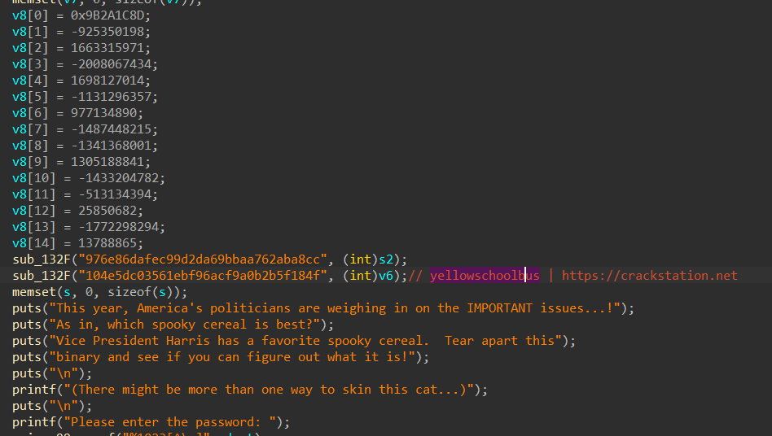<br>
We notice in the password checker that a function is called, and pass v8 data and v6 hash of yellowschoolbus.<br> 
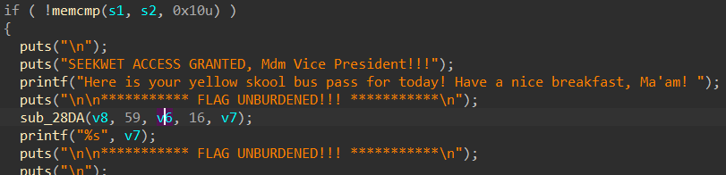<br>
This function is RC4 : <br>
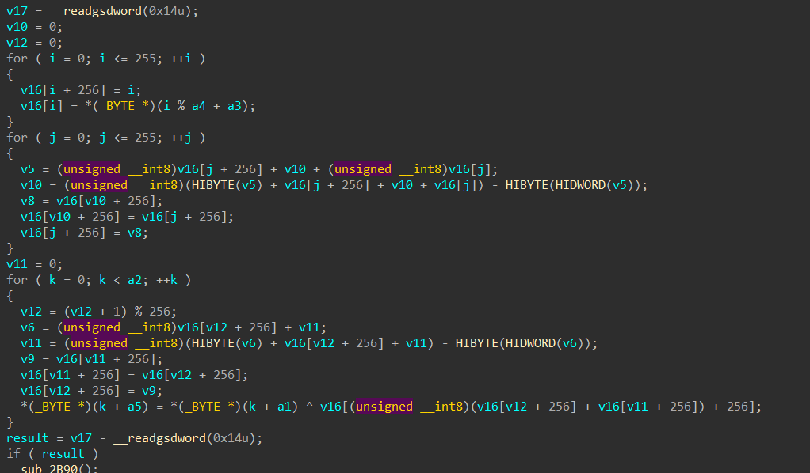<br>
After converting v8 data to big endian we can decipher using cyberchef and grab the flag : <br>
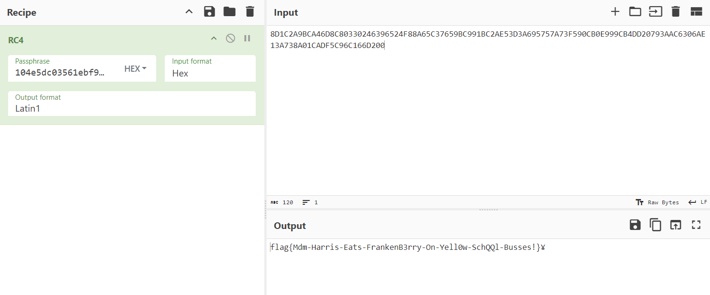 `flag{Mdm-Harris-Eats-FrankenB3rry-On-Yell0w-SchQQl-Busses!}`
### CEREALKILLER 05
I reversed the compiled java aplication using jadx :
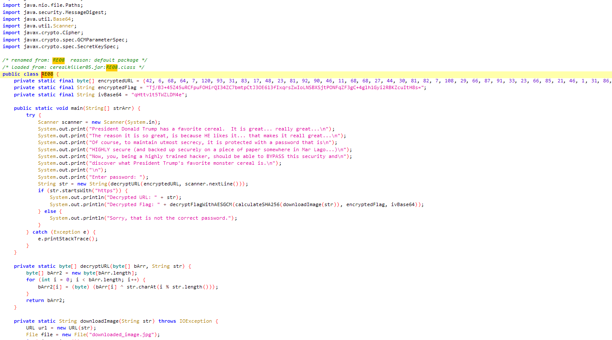
we can simply do a KPA with XOR on the link knowing first 5 bytes are `https` to get the key `Br00t` and grab all image link, we then compute hash of the image and we can decipher flag which has been ciphered by AES-GCM. see my solve script below :<br>
```python
from pwn import *
import requests
import hashlib
import base64
from Crypto.Cipher import AES
from Crypto.Util.Padding import unpad
from pathlib import Path

def decrypt_flag_with_aes_gcm(key, nonce_base64, ciphertext_base64):
    nonce = base64.b64decode(nonce_base64)
    ciphertext = base64.b64decode(ciphertext_base64)
    cipher = AES.new(key, AES.MODE_GCM, nonce=nonce)
    plaintext = cipher.decrypt(ciphertext)
    return plaintext

encrypted = [42, 6, 68, 64, 7, 120, 93, 31, 83, 17, 48, 23, 81, 92, 90, 46, 11, 68, 68, 27, 44, 30, 81, 82, 7, 108, 29, 66, 87, 91, 33, 23, 66, 85, 21, 46, 1, 31, 86, 6, 45, 29, 68, 82, 6, 45, 29, 68, 30, 30, 50, 23, 87]
encrypted_bytes = b""
for e in encrypted:
    encrypted_bytes+=e.to_bytes()

image_link = xor(encrypted_bytes, "Br00t") # l'image se récup avec https
with open("frootbroot.jpeg", "rb") as file:
    data = file.read()

key = hashlib.sha256(data).digest()
ivbase64 = "qHttv1t5TWZLDM4e"
ciphertext_base64 = "Tj/BJ+45Z45uRCFpuFOHirQI34ZC7bmtpCtJ3OE613fIxqrsZwIoLNSBXSjtPONFqZF3gC+4glh1Gyi2RBKZcuItH8s="

print(decrypt_flag_with_aes_gcm(key, ivbase64, ciphertext_base64)) # flag{Fr00t-Br00t-is-the-only-cereal-for-Prez-Trump!}
```

## Cryptography
### Social Pressure
Just use atbash cipher from [dcode](https://www.dcode.fr/chiffre-atbash), which allows us to decipher the conversation :
```
luciafer 

Hey lilith, big news! We're going after De Monne Financial next. Their security measures have some holes that we're gonna exploit big time! I've been poking around and found some SQL vulnerabilities we can leverage for maximum chaos.

Remember that IT guy I mentioned before? Turns out, he’s a real chatty Cathy on social media. Think we can use some good ol' social engineering to our advantage. We’ll get him spewing passwords like a leaky faucet. Plus, with your OSINT skills and my SQL magic, they won’t see what hit 'em.

lilith

I've already started some OSINT recon and guess what? Found some juicy deets about their IT team on LinkedIn. People overshare so much, it's practically a goldmine. Social engineering that chatty dude should be a breeze; I'll craft a legend that'll have him spilling everything.

luciafer

Yaaas, this is gonna be legendary! Loving the enthusiasm. And Elroy Ongaro? That guy's practically rolling out the red carpet for us with how much he shares online. Can't believe how easy some of these targets make it.

lilith

Absolutely! Elroy Ongaro has no idea what's coming his way. I've already got a few angles in mind to get him talking. Social engineering these types is always a thrill.

I'll start drafting some personas and scripts. Once he's under our influence, we can orchestrate the SQL exploit seamlessly. Your expertise in that area is going to be crucial.

# flag{Elroy_Ongaro}
```
### Discreet Logging 
In this challenge we have access to some kind of logs of computation : 
```
computing discrete log for prime: 191
discrete log found: 25
computing discrete log for prime: 1621
discrete log found: 293
computing discrete log for prime: 61
discrete log found: 49
computing discrete log for prime: 2447
discrete log found: 2105
...
```
At first I thought it was logging about DLP (Discrete Logarithm Problem) where we have to solve equation $`g^x = h \ (mod \ p)`$ knowing $`(x, p)`$ and I thought flag char was the $`h`$ value, but actually it was just CRT (Chinese Remainder Theorem) which allow us to solve congruence system see details [here](https://en.wikipedia.org/wiki/Chinese_remainder_theorem).
So first I've written this script to parse data from the web page logs : 
```python
import requests

url = "https://cyberhacktics.sfo2.digitaloceanspaces.com/DEADFACECTF2024/challenges/crypto/crypto13/ecdh_crack_20241013.log"
PRIMES = []
LOGS = []
resp = requests.get(url)
data = resp.text

for line in data.split('\n'):
    if 'computing' in line:
        PRIMES.append(int(line.replace('computing discrete log for prime: ', '')))
    else:
        LOGS.append(int(line.replace('discrete log found: ', '')))
print(PRIMES)
print(LOGS)
```
Finally in sage we can do this : 
```python
from Crypto.Util.number import long_to_bytes
nis = [191, 1621, 61, 2447, 991, 1297, 47, 1049, 347, 283, 2617, 1429, 167, 307, 431, 683, 1627, 17, 827, 97, 523, 151, 37, 2269, 1733, 3, 19, 439]
cis = [25, 293, 49, 2105, 564, 50, 13, 21, 229, 257, 307, 511, 124, 7, 63, 476, 1054, 2, 793, 60, 270, 145, 32, 796, 1041, 1, 9, 60]
print(long_to_bytes(crt(cis, nis)) # flag{ch1n3s3-r3mAind3r-D-l0g}
```

### Drink Up
Challenge provide this image : <br>
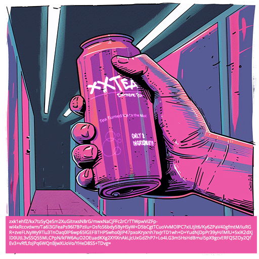<br>
We also have the ciphertext written on the image : `zxk1ehfZ/kx7tzSyQeSm2XuGitnxsN8rG/mwxNaCjFFc2rCrTTWpwViZFpwI4xRccvdwm/Ta6l3GFeaPs96l7BPziIu+DsfoS6bdy5ByHSyW+D5bCgtTCuoVvMOlPC7xILtjlt6/Ky6ZPaV40gfmtM/iuRGR+zveFLNyWy9Tlu3TnOaq0lP6wp65lGEFBTHPSwho0jIP47pxoKryxnh7svJrTD1wh+D+YudNjDpPr39yH/iMlU+5xiK2dXjiD0UtL3vSSQ55MLCPpN/kFW6AuO2OEuadKXg2XYiXnAkLJcUxGdZhP7+Lo4LG3m5HsHdBmul5pX9gcvERFQSZOy2QfEv3+vRfLfoJPq6WQnBjwXUoVo/YHeD8SS+TDvg=`<br>
The word "XXTEA" written on the image refers to the cipher that has been used, also I've tried different posssibilities of key like "only2ingredients..."<br>
And I've finally found the key just by using words in the image, here is the solution script to decipher xxtea using python : <br>
```python
# pip install xxtea-py
import base64
cipher_text_base64 = "zxk1ehfZ/kx7tzSyQeSm2XuGitnxsN8rG/mwxNaCjFFc2rCrTTWpwViZFpwI4xRccvdwm/Ta6l3GFeaPs96l7BPziIu+DsfoS6bdy5ByHSyW+D5bCgtTCuoVvMOlPC7xILtjlt6/Ky6ZPaV40gfmtM/iuRGR+zveFLNyWy9Tlu3TnOaq0lP6wp65lGEFBTHPSwho0jIP47pxoKryxnh7svJrTD1wh+D+YudNjDpPr39yH/iMlU+5xiK2dXjiD0UtL3vSSQ55MLCPpN/kFW6AuO2OEuadKXg2XYiXnAkLJcUxGdZhP7+Lo4LG3m5HsHdBmul5pX9gcvERFQSZOy2QfEv3+vRfLfoJPq6WQnBjwXUoVo/YHeD8SS+TDvg="
cipher_text = base64.b64decode(cipher_text_base64)

key = b"Tea Turned Up to the Max"
plain_text = xxtea.decrypt(cipher_text, key)
b"Ah, I see you've stumbled upon my little souvenir. By now, you must be feeling pretty exposed. It's a shame companies like yours invest in everything but proper security. Remember, this isn't personal; it's just your turn. Sleep tight, spookyboi was here. flag{br3wed_4_the_B0ld!}"
```
### Killer Curve
This one was definitely hardest crypto challenge of the competition we have a binary which allows us to connect to a server by sending a public key, server will use it to compute shared key and send us back this shared key to cipher any file we want.<br>
Reversing this binary was kind of hard, but I've noticed some interesting stuff in it, concidering the format of the key which is given by this line : `v91.str = (uint8 *)"Public key in hex format (x:y)";`<br>
Also the type of curve being used : <br>
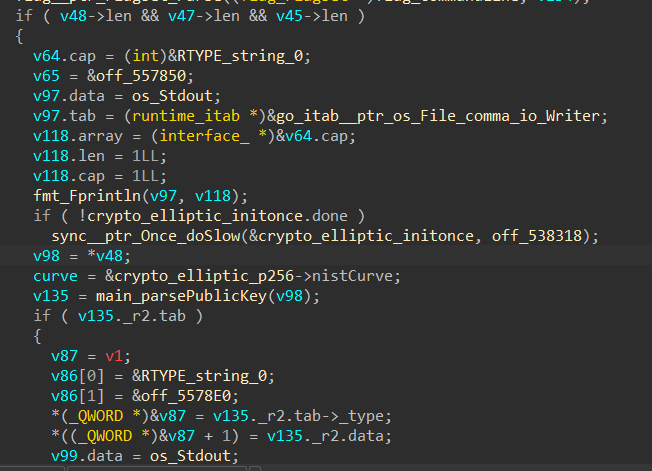<br>
Here is an example of usage of the binary :<br>
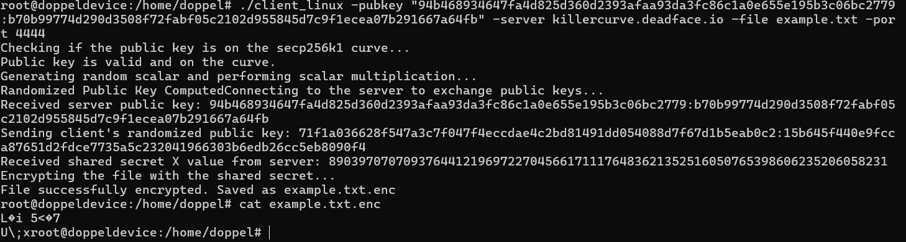
We notice that the type of curve printed by the binary wasn't the same than the one we saw in the code, so i've took the elliptic curve parameters of the one in code. <br>
Before entering in the crypto attack we're going to implement, let's review definition of an Elliptic Curve over a finite field $`\mathbb{F}_p`$ which is defined by the following equation : $`E : Y^2 = X^3 + aX + b \ (mod \ p)`$ with $`a, b, p`$ parameters of the curve, and $`(X, Y)`$ coordinates of points on the curve, we can add points together and multiply those points, it also exists point at infinity written $`O`$
Point addition on $`E(\mathbb{F}_p)`$ is a bit particular see this theorem :
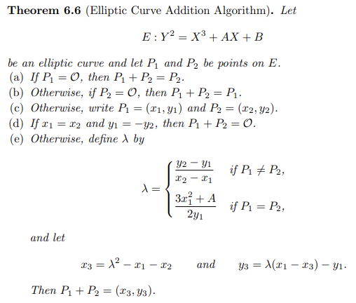<br>
As we can add points together we can also multiply points by a scalar $`l`$, for example if i take a random point $`P`$ on my elliptic curve and compute $`lP = Q`$ it will give me another point on the curve see double and add algorithm.<br>
And this is exactly the problem we are facing on this challenge, it is about solving ECDHKE (Elliptic Curve Diffie Hellman Key Exchange) to find the scalar $`l`$ which is the private key of the server :).<br>
On the challenge, when I connect to the server it always gives me the same public key :
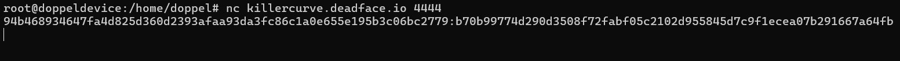
The curve which is used by the challenge is this one : https://neuromancer.sk/std/secg/secp256r1.<br>
I've also noticed that if I send a point which is not suppose to be on that curve, server accept it and compute shared secret anyway see below : 
In my terminal : 
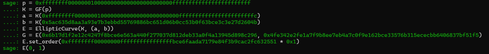
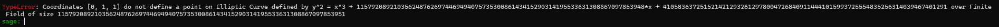
To the remote server :
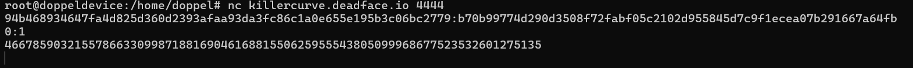
Noticing this, we know it's invalid curve attack that can allow us to get the private key of the server, now let's review what's invalid curve attack.<br>
As the b constant is not used in the scalar multiplication, we need to find curves with same a but diffferent small b which gives us a smooth order for the curve, we will send multiple evil points from different curves everytime and we will get the answer of the server.<br>
To generate the evil point, we factorise the order of the curve, take a small factor of it and take a point that has this factor as order.<br>
We then compute discrete log of the answer of the server, and use crt on all those discrete logs to get the private key, care to send enough evil points until order of product of all evil points above the order of the curve :).<br>
Here is my solve script (adapted from here https://www.hackthebox.com/blog/business-ctf-2022-400-curves-write-up)<br>
```python
from Crypto.Util.number import long_to_bytes
from sage.all_cmdline import *
from pwn import *

a = 0xffffffff00000001000000000000000000000000fffffffffffffffffffffffc
b = 0x5ac635d8aa3a93e7b3ebbd55769886bc651d06b0cc53b0f63bce3c3e27d2604b
p = 0xffffffff00000001000000000000000000000000ffffffffffffffffffffffff

K = GF(p)

def solveDL(r):
    b = randint(1, p)
    E = EllipticCurve(GF(p), [a, b])
    K = GF(p)
    order = E.order()
    factors = prime_factors(order)

    valid = []
    for factor in factors:
        if factor <= 2**40:
            valid.append(factor)

    prime = valid[-1]

    G = E.gen(0) * int(order / prime)

    tmp_point = G.xy()
    tmp_x, tmp_y = str(hex(tmp_point[0]))[2:], str(hex(tmp_point[1]))[2:]
    tmp_point = tmp_x + ":" + tmp_y
    r.sendline(tmp_point)
    data = int(r.recvline().decode())
    print(data)
    try:
        Q = E.lift_x(K(data))
        print("Computing the discrete log problem")
        log = G.discrete_log(Q)
        print(f"DL found: {log}")
        return (log, prime)
    except Exception as e:
        print(e)
        return None, None

def getDLs():
    dlogs = []
    primes = []
    multi = 1
    while multi <= 0xffffffff00000000ffffffffffffffffbce6faada7179e84f3b9cac2fc632551:
        r = remote("killercurve.deadface.io", 4444)
        print(r.recvline())
        log, prime = solveDL(r)
        print(log)
        print(prime)
        if log != None:
            dlogs.append(log)
            primes.append(prime)
            multi *= prime
        print(f"counter: {i}")
    return dlogs, primes


def pwn():
    dlogs, primes = getDLs()
    print(f"dlogs: {dlogs}")
    print(f"primes: {primes}")
    l = len(dlogs)
    print(l)
    for i in range(2**l):
        signs = [1 if i & (1 << j) else -1 for j in range(l)]
        secret = crt([dlog * sign for dlog, sign in zip(dlogs, signs)], primes)
        if b'flag' in long_to_bytes(secret):
            print(long_to_bytes(secret)) # flag{1nv@l1d-cUrv3}

if __name__ == "__main__":
    pwn()
```

